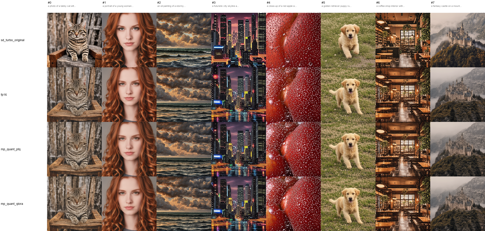

# EdgeDiffuse — Edge-Deployable SD-Turbo via Multi-Stage Compression

A complete model compression pipeline for **SD-Turbo**, designed for **edge deployment** on consumer GPUs.
Three compression stages — structural pruning, knowledge distillation, and sensitivity-aware mixed-precision quantization — produce a model that is **smaller, faster, and visually faithful** to the original.

> **TL;DR**: From `stabilityai/sd-turbo` (860 M, ~1.7 GB) → final compressed model at roughly half the size, with **near-zero quantization quality cost** thanks to per-layer mixed precision + Hessian-based GPTQ, plus QLoRA recovery.



---

## Headline numbers

Benchmark on **RTX 5070 (Blackwell, 12 GB VRAM)** at 512 × 512, **2-step inference**:

| Variant | Params | Stored size | Latency | VRAM | LPIPS vs original | LPIPS vs fp16 baseline |
|---|---:|---:|---:|---:|---:|---:|
| `stabilityai/sd-turbo` (original) | 860 M | 3.30 GB † | 0.146 s | 3.05 GB | 0 | 0.278 |
| **fp16 baseline** (pruned + distilled) | 642 M | 2.45 GB † | **0.142 s** | 2.64 GB | 0.278 | 0 |
| **mp_quant PTQ** (Stage 3, GPTQ) | 642 M | 1.22 GB | 0.145 s | 2.64 GB | 0.277 | 0.062 |
| **mp_quant + QLoRA** (Stage 4) | 642 M + 9 MB | 1.23 GB | 0.171 s ‡ | 2.65 GB | 0.278 | **0.057** |

† fp32 stored on HF for max precision; loaded as fp16 in memory.
‡ peft LoRA forward adds overhead; can be **merged into base** at deploy time for zero runtime cost.

### What these numbers say

- **Pruning + distillation** is the dominant cost vs original (~99 % of the LPIPS gap).
- **Mixed-precision quantization (GPTQ)** is essentially free: PTQ moves LPIPS by 0.062 (visually indistinguishable per side-by-side inspection) at no measurable speed cost.
- **QLoRA recovery (500 steps)** further reduces quality gap by 8 % (0.062 → 0.057).
- Switching from 4-step to 2-step inference cut latency 28 % at no quality cost — see [why 2-step](#why-2-step-inference-instead-of-4).

---

## Pipeline overview

```
                          stabilityai/sd-turbo    (860 M params, ~1.7 GB fp16)
                                    │
                                    ▼
                ┌─────────────────────────────────────┐
                │  Stage A — Structural Pruning        │   ┐
                │  • LD-score layer sensitivity        │   │
                │  • Taylor channel selection          │   │  in `prune/`
                │  • ~25 % parameter reduction         │   │
                └─────────────────────────────────────┘   │
                                    │                     │
                                    ▼                     │  shipped as
                ┌─────────────────────────────────────┐   │  ChenHe727/EdgeDiffusion_distilled_feat_attn
                │  Stage B — Distillation              │   │
                │  • Step-wise teacher-student match   │   │
                │  • MSE + λ·L1, per-step independent  │   │
                │  • EMA model + per-timestep loss norm│   │
                └─────────────────────────────────────┘   ┘
                                    │
                            642 M, ~1.2 GB fp16  ← starting point for mp_quant
                                    │
                                    ▼
                ┌─────────────────────────────────────┐
                │ Stage 1 — Sensitivity profiling      │   ┐
                │ Per-layer × bit-width LD-score sweep │   │
                └─────────────────────────────────────┘   │
                                    │                     │
                ┌─────────────────────────────────────┐   │
                │ Stage 2 — Bit-width solver           │   │
                │ Binary-search sensitivity threshold  │   │
                │ → per-layer {fp16, int8, int4}       │   │  in `mp_quant/`
                └─────────────────────────────────────┘   │
                                    │                     │
                ┌─────────────────────────────────────┐   │  ← THIS REPO'S MAIN
                │ Stage 3 — Apply GPTQ                 │   │    CONTRIBUTION
                │ Self-implemented GPTQ (~200 LOC)     │   │
                │ Hessian-based error compensation     │   │
                └─────────────────────────────────────┘   │
                                    │                     │
                ┌─────────────────────────────────────┐   │
                │ Stage 4 — QLoRA recovery             │   │
                │ Frozen quantized base + LoRA adapter │   │
                │ Step-wise teacher-student loss       │   │
                └─────────────────────────────────────┘   │
                                    │                     │
                ┌─────────────────────────────────────┐   │
                │ Stage 5 — Evaluation                 │   │
                │ Latency, VRAM, LPIPS vs 2 references │   │
                └─────────────────────────────────────┘   ┘
                                    │
                            Final compressed model
```

---

## Key technical decisions

### Why mixed-precision quantization, not uniform INT8?
[`quantize/`](quantize/) contains a baseline study: uniform-INT8 weight-only quantization (via `torchao`) **runs no faster than fp16** on Blackwell — the INT8 weight-only kernel doesn't beat fp16 tensor cores at batch = 1. Per-layer mixed precision is the principled approach: identify which layers can survive INT4 (least sensitive), which can handle INT8, and which must stay at fp16.

### Why LD-score for quantization sensitivity?
The same LD-score (Latent Distribution score = mean + std distance of UNet output) used during pruning sensitivity analysis is reused here for **bit-width assignment**. This unifies the methodology across both compression stages.

For each layer, we quantize it **alone** at each candidate bit-width and measure the LD-score against the fp16 baseline UNet's output across 128 calibration samples (32 prompts × 4 timesteps). The resulting per-layer × per-bit-width sensitivity table drives a binary-search solver in Stage 2.

### Why GPTQ instead of round-to-nearest?
Round-to-nearest (RTN, what `torchao.Int8WeightOnlyConfig` does) quantizes each weight in isolation — rounding errors don't compensate. **GPTQ** ([Frantar et al. 2023](https://arxiv.org/abs/2210.17323)) uses calibration data and a Hessian-based update: when weight `w_i` is quantized, the rounding error is distributed to the not-yet-quantized weights via the Hessian inverse, minimizing layer reconstruction error. For INT4 this is the difference between usable and broken.

GPTQ is **self-implemented** (~200 LOC) in [`mp_quant/gptq.py`](mp_quant/gptq.py). Mainstream GPTQ libraries (`auto-gptq`, `gptqmodel`) target LLMs; adapting them to our custom pruned UNet would have been more work than a clean implementation from the paper.

### Why QLoRA instead of QAT?
QAT trains the quantization scales / zero-points on top of the frozen quantized base. **QLoRA** (Dettmers et al. 2023) instead trains low-rank adapters (LoRA matrices A, B of rank 8) on top of the frozen quantized base.

LoRA gives stronger **expressiveness** (low-rank corrections vs. only scale shifts), has **mature tooling** (`peft`), and can be **merged into the base** at inference time — zero runtime overhead. Trainable parameters: **0.36 % of total** (2.30 M out of 644 M).

### Why 2-step inference instead of 4
Empirically: 2-step beats 4-step on both speed **and** quality for SD-Turbo derivatives. Reasons:

1. SD-Turbo is fundamentally trained with adversarial diffusion distillation **targeting 1-step generation**; > 2 steps drifts from the trained regime.
2. The 4-step `[999, 749, 499, 249]` schedule expects the model to make small refining jumps, but our compressed model's per-step drift compounds across more steps.
3. EulerAncestralScheduler **injects fresh noise** at every step — more steps = more stochastic drift even with fixed seed.

Result: 0.198 s @ 4-step → 0.142 s @ 2-step (28 % faster), LPIPS marginally better (0.067 → 0.062). Config now defaults to 2 steps.

---

## Reproducing the results

### Setup

```bash
# Python 3.10+, CUDA 12.8+ (for Blackwell)
pip install torch torchvision --index-url https://download.pytorch.org/whl/cu128
pip install diffusers transformers peft safetensors accelerate huggingface_hub
pip install torchao triton-windows   # quantization + compile (Windows shown)
pip install lpips                     # evaluation metric
```

### Stage A + B (already shipped on HF)
The pruned + distilled fp16 UNet is available at [`ChenHe727/EdgeDiffusion_distilled_feat_attn`](https://huggingface.co/ChenHe727/EdgeDiffusion_distilled_feat_attn). The mp_quant pipeline downloads it automatically.

To re-run Stages A and B from scratch, see [`prune/`](prune/) — `sensitivity_ld.py`, `sp_apply.py`, `sp_distill.py`.

### Stages 1 – 5 (mp_quant pipeline)
Each stage is a self-contained script reading the shared config at [`mp_quant/mp_quant_config.yaml`](mp_quant/mp_quant_config.yaml). Run in order:

```bash
# Stage 1 — Per-layer sensitivity profiling (~25 min on RTX 5070)
python mp_quant/sensitivity.py
# → mp_quant/results/sensitivity.json

# Stage 2 — Solve per-layer bit-width assignment
python mp_quant/bitwidth_solver.py --target 0.4
# → mp_quant/results/bitwidth_config.json

# Stage 3 — Apply GPTQ quantization (~30 s)
python mp_quant/apply_quant.py
# → mp_quant/output/distill_final_mp_r37.safetensors + .config.json

# Stage 4 — QLoRA recovery (500 steps, ~10 min)
python mp_quant/qlora_recovery.py --steps 500
# → mp_quant/output/lora_adapter.pt

# Stage 5 — Evaluation
python mp_quant/evaluate.py
# → mp_quant/results/eval_grid_2step.png + eval_metrics_2step.json
```

A full pipeline run takes about an hour end-to-end on a single consumer GPU.

### Quick proof-of-concept
[`mp_quant/poc_gptq_qlora.py`](mp_quant/poc_gptq_qlora.py) validates the full GPTQ → LoRA training tool chain on a small subset (20 layers × 20 training steps) in under a minute. Useful for verifying the environment before running the full pipeline.

---

## Repository layout

```
.
├── README.md                            ← this file
├── prune/                               Pruning + distillation (Stages A, B)
│   ├── sensitivity_ld.py                LD-score layer sensitivity
│   ├── sp_core.py                       Taylor channel selection + softmask
│   ├── sp_apply.py                      Apply pruning, rebuild UNet
│   ├── sp_distill.py                    Step-wise teacher-student training
│   └── pruned_rebuild.py                Load pruned UNet from safetensors
├── quantize/                            Naive uniform-quantization baseline
│   ├── quantize.py                      Test 5 torchao recipes
│   └── evaluate.py                      Compare all recipes
└── mp_quant/                            Mixed-precision quantization
    ├── PLAN.md                          Detailed design + interview Q&A
    ├── mp_quant_config.yaml             All-stages shared config
    ├── gptq.py                          Self-implemented GPTQ algorithm
    ├── sensitivity.py                   Stage 1: per-layer profiling
    ├── bitwidth_solver.py               Stage 2: bit-width assignment
    ├── apply_quant.py                   Stage 3: apply GPTQ
    ├── qlora_recovery.py                Stage 4: LoRA training
    ├── evaluate.py                      Stage 5: end-to-end metrics
    ├── poc_gptq_qlora.py                Quick tool-chain validation
    ├── output/                          Quantized weights + LoRA
    └── results/                         Sensitivity, eval, plots
```

---

## Limitations & future work

This is **v1**. The pipeline is end-to-end working, but several known refinements are deferred:

### v1 limitations

- **Conv2d layers are not quantized.** mp_quant currently targets only `nn.Linear` (attention projections, FFN). Conv2d quantization needs a separate path (torchao's `Int8WeightOnlyConfig` doesn't quantize Conv2d, and GPTQ-for-conv is uncommon in mainstream libraries). Conv2d holds ~70 % of UNet parameters, so this caps the achievable size reduction.
- **Fake quantization for storage.** Quantized weights are rounded to the INT4/INT8 grid but stored as bf16. A packing step (INT4 → 4 bits/value, INT8 → 1 byte) would produce real on-disk savings; for v1 we focused on validating quality. The current 1.22 GB file would shrink to ~900 MB if packed.
- **Pruning is the dominant LPIPS cost.** ~99 % of the quality gap from the original SD-Turbo comes from Stages A + B; mp_quant adds only 0.06. A refined pruning run would lower the total LPIPS more than further quantization work.
- **No FID / CLIP score yet.** Quality is measured via LPIPS (8 prompts) + visual inspection. Full FID benchmark would require 500 – 1000 generations against a reference set.
- **Single-step LD-score sensitivity** doesn't capture cross-step error accumulation. Trajectory-based sensitivity is future work.

### Planned v2 improvements

| # | Change | Expected impact |
|---|---|---|
| 1 | Re-run pruning with **Taylor-based channel masking** (code already in `prune/sensitivity_ld.py --channel-selection taylor`) | Eliminates the magnitude-vs-Taylor mismatch flagged in the design review; cleaner methodology defence. |
| 2 | Quantize Conv2d via a custom GPTQ-for-conv path | Up to ~30 % additional size reduction. |
| 3 | Pack quantized weights into real INT4/INT8 storage | ~25 % file-size reduction (1.22 GB → ~900 MB). |
| 4 | Full FID + CLIP score benchmark on 1000 generations | Replaces approximate LPIPS proxy with publication-grade metric. |
| 5 | Full 2000-step QLoRA training | Slightly tighter recovery; current 500-step is "mini" verification. |
| 6 | Trajectory-based sensitivity (account for cross-step error accumulation) | More accurate bit-width assignment; potentially fewer fp16 layers needed. |

---

## Acknowledgments

- **LD-Pruner** ([Castells et al. 2024](https://arxiv.org/abs/2404.11936)) — latent-distribution sensitivity metric.
- **GPTQ** ([Frantar et al. 2023](https://arxiv.org/abs/2210.17323)) — Hessian-based PTQ algorithm reimplemented here.
- **QLoRA** ([Dettmers et al. 2023](https://arxiv.org/abs/2305.14314)) — parameter-efficient quantized fine-tuning.
- **SD-Turbo** ([Sauer et al. 2023](https://stability.ai/research/adversarial-diffusion-distillation)) — the base model.
- **torchao** — Blackwell-aware FP4/FP8/INT4/INT8 reference implementations used in the baseline study.

---

## Cite / contact

If you use this code or build on these techniques, please cite the upstream papers above. Issues and pull requests welcome.

Maintainer: Chen He (`SeanHe727` on GitHub, `ChenHe727` on Hugging Face).
