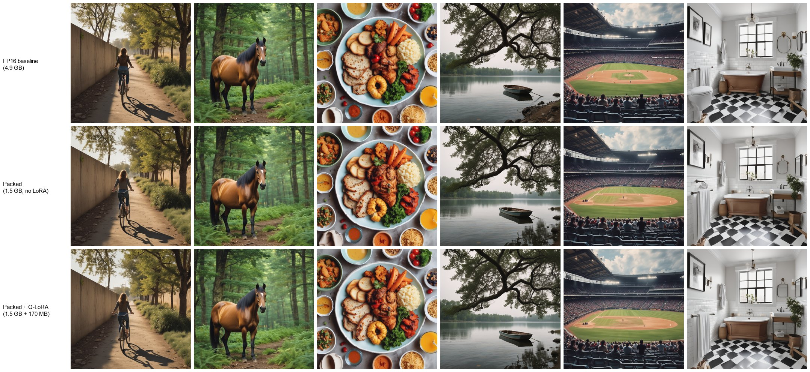
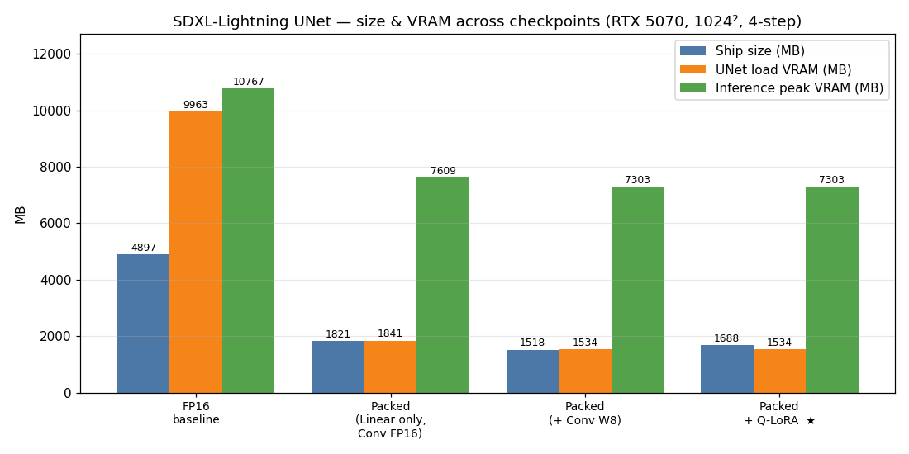
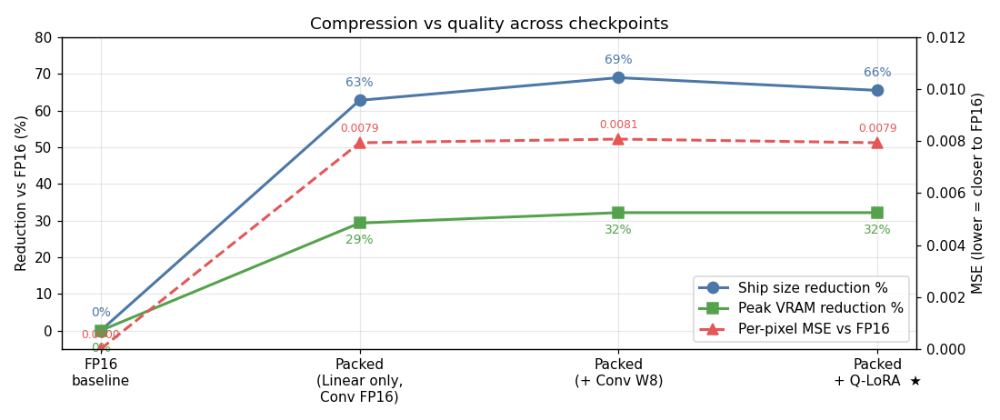

# EdgeDiffusion — SDXL-Lightning for Edge Deployment

A reproducible post-training pipeline that takes the **SDXL-Lightning 4-step UNet** (2.6 B params, 4.9 GB fp16) to an edge-deployable artifact at **1.5 GB packed + 170 MB LoRA (-65 % ship size)** with **inference peak VRAM 7.3 GB (-32 %)** at near-zero visual quality loss on a consumer GPU.

> **TL;DR** — Block-level mixed-precision (W4 in the 3 deepest cross-attention blocks, W8 elsewhere) + self-implemented GPTQ + INT4-nibble packed safetensors + `PackedInt4Linear` / `PackedInt8Linear` / `PackedInt8Conv2d` module replacement + rank-16 Q-LoRA distillation.

## Headline numbers (RTX 5070, 1024×1024, 4 steps)

| Metric | FP16 baseline | This pipeline | Change |
| --- | ---: | ---: | ---: |
| UNet ship size | 4897 MB | **1518 + 170 MB** | **-65.5 %** |
| UNet load VRAM | 9963 MB | 1534 MB | **-85 %** |
| Inference peak VRAM | 10767 MB | **7303 MB** | **-32 %** |
| Per-pixel MSE vs FP16 (64 prompts) | 0 | 0.00794 | hard to see side-by-side |

Full numbers per stage in [BENCHMARKS.md](BENCHMARKS.md).

## Visual comparison



*Top: FP16 baseline. Middle: Packed (no LoRA). Bottom: Packed + Q-LoRA — the final deliverable.*

## Compression across checkpoints




## Pipeline

1. **Block-level sensitivity profiling** — measure UNet output drift after quantizing each transformer block jointly to INT4/INT8 → `tools/profile_sdxl_lightning_block_sensitivity.py`
2. **Mixed-precision bit assignment** — W4 in `mid_block`, `down_blocks.2`, `up_blocks.0` (deepest, attention-heavy, ~95 % of params); W8 elsewhere; FP16 on latent-adjacent convs.
3. **GPTQ for W4 Linears** — self-implemented Hessian + Cholesky inverse + column-wise error compensation. Image MSE drops 0.0154 → 0.0080 vs RTN. → `mp_quant/gptq.py`
4. **Real packed storage** — INT4 as signed nibbles (2/byte) + per-group fp16 scales; INT8 raw + per-channel scales; FP16 pass-through. → `mp_quant/pack_sdxl_lightning_weight.py`
5. **Packed module replacement** — `PackedInt4Linear` / `PackedInt8Linear` / `PackedInt8Conv2d` keep weights packed on device, dequantize inside `forward()`. → `mp_quant/packed_linear.py`
6. **Q-LoRA recovery** — rank-16 LoRA on all 722 quantized Linears against pre-cached FP16 teacher noise predictions (512 samples). Gradient checkpointing keeps training peak VRAM at 3 GB. Inference α=4 mitigates exposure bias. → `mp_quant/qlora_train.py`

## Quick start

```bash
# 1) Fake-quant SDXL-Lightning UNet (block MP + GPTQ on W4)
python tools/run_sdxl_lightning_dataset_fakequant.py \
  --repo-root . --output-dir gen_test_output/quant \
  --method gptq --gptq-bits 4 --linear-bits 8 \
  --linear-block-bits "mid_block=4,down_blocks.2=4,up_blocks.0=4" \
  --conv-bits none --save-unet

# 2) Pack to INT4/INT8/FP16 mixed safetensors
python mp_quant/pack_sdxl_lightning_weight.py \
  --fakequant-dir gen_test_output/quant \
  --output-dir   models/real_quant/sdxl_lightning_weight \
  --conv-include "down_blocks.1,down_blocks.2,mid_block,up_blocks.0,up_blocks.1" \
  --conv-bits 8

# 3) Q-LoRA recovery (optional)
python mp_quant/qlora_cache_teacher.py --repo-root . --output-dir qlora_teacher_cache
python mp_quant/qlora_train.py \
  --packed-safetensors models/real_quant/sdxl_lightning_weight/*.safetensors \
  --teacher-cache qlora_teacher_cache --output-dir qlora_run --rank 16

# 4) Eval (packed + LoRA vs FP16, α=4)
python mp_quant/eval_packed_with_lora.py \
  --packed-safetensors models/real_quant/sdxl_lightning_weight/*.safetensors \
  --lora qlora_run/lora_final.safetensors --lora-alpha 4 --repo-root .
```

## Limitations

- **No latency win yet.** `PackedLinear.forward()` dequantizes to fp16 then calls cuBLAS, so per-step latency matches FP16. Real speedup needs a fused W4×fp16 Triton kernel or TensorRT 10 export — planned v2.
- **Stage-4 INT kernel survey** (torchao / bitsandbytes on Blackwell sm_120) is in [BENCHMARKS §8](BENCHMARKS.md). Short version: off-the-shelf libraries either break SDXL quality (per-channel) or fall back to slow paths (per-group, sm_120).

## Hardware tested

RTX 5070 12 GB (sm_120, Blackwell consumer), Windows 11, 64 GB RAM, PyTorch 2.12 + CUDA 12.8. Target 7.3 GB peak fits RTX 4060+/4070+/5070+ desktops and Jetson Orin 16 GB.

## Acknowledgments

- **SDXL-Lightning** ([Lin et al. 2024](https://arxiv.org/abs/2402.13929)) — base model
- **GPTQ** ([Frantar et al. 2023](https://arxiv.org/abs/2210.17323)) — algorithm reimplemented here
- **QLoRA** ([Dettmers et al. 2023](https://arxiv.org/abs/2305.14314)) — adapter recovery, adapted from LLMs to diffusion

Maintainer: Chen He ([`SeanHe727`](https://github.com/SeanHe727) on GitHub, [`ChenHe727`](https://huggingface.co/ChenHe727) on Hugging Face).
